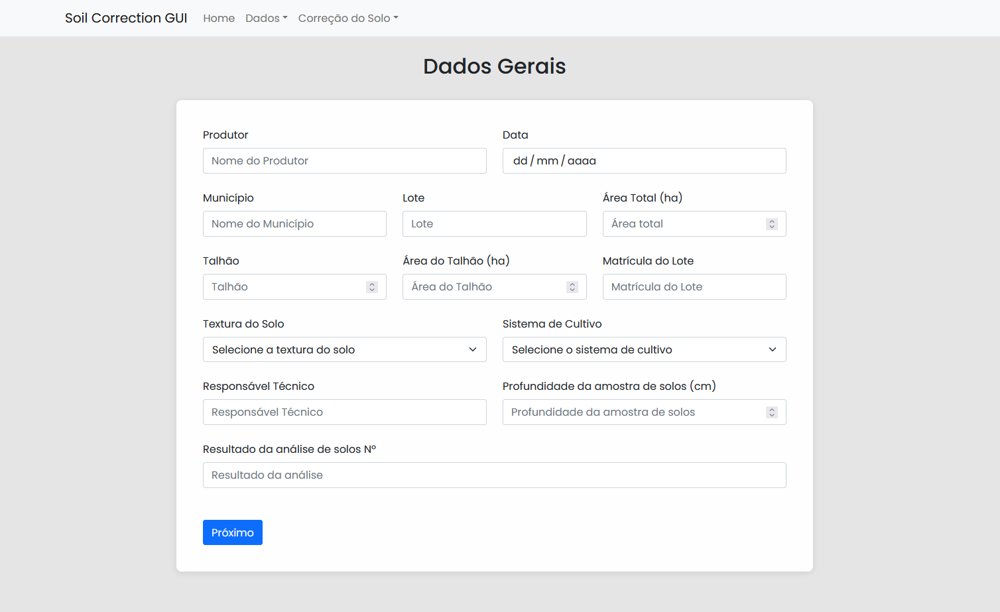
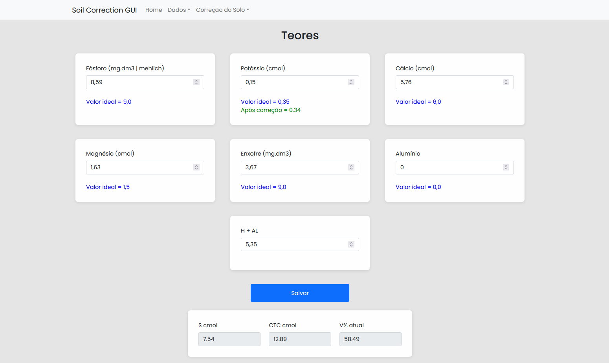
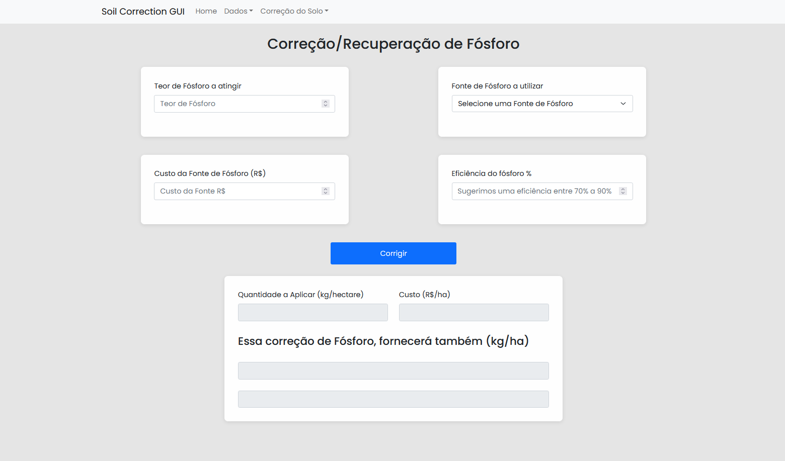
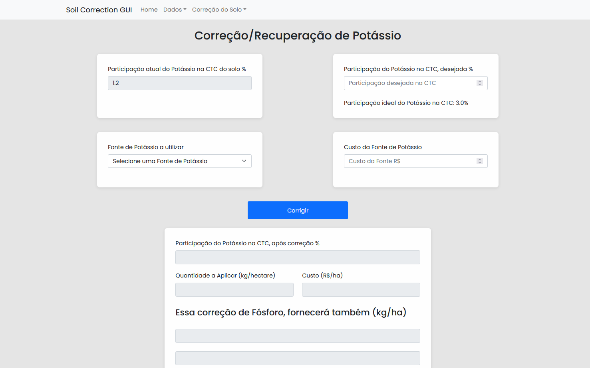
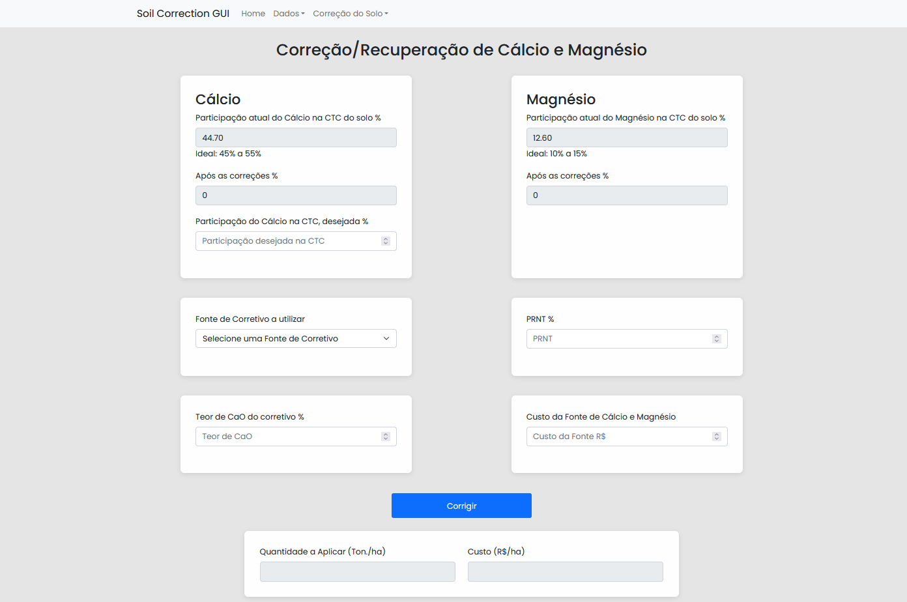

# Soil Correction GUI

Criação de uma interface gráfica para o projeto [Soil Correction](https://github.com/raulval/sa-soilcorrection) da disciplina de Arquitetura de Software UTFPR-CP.

# Tecnologias

A elaboração da interface gráfica foi feita usando o React, foi utilizado também o Redux para persistência dos dados.

# Screenshots

### Tela Home
  <h1 align="center">
    
  </h1>
A tela home conta com a logo do IDR-Paraná em um Header para navegar por todas as páginas do site.

---

### Tela de Dados
  <h1 align="center">
    
  </h1>
  
A tela de dados é onde o usuário irá preencher os campos necessários para fazer os cálculos do restante da aplicação. Clicando no botão próximo ele vai para a tela de Teores.

---

### Tela de Teores
  <h1 align="center">
    
  </h1>

Na tela de Teores é que o usuário coloca os dados necessários para a aplicação funcione corretamente. A escolha da textura do solo na tela de Dados impacta nos valores ideais. Após o usuário preencher todos os campos e clicar em salvar o valor de S cmol, CTC cmol e V% atual são calculados e os dados ficam salvos continuando na tela de Teores.

---
### Tela de Correções
  <h1 align="center">
    
    
    
  </h1>

Na tela de correções é onde os cálculos são feitos para chegar nos valores ideais propostos. Cada correção tem seus próprios componentes, sendo em comum a quantidade a aplicar e o custo.

# Iniciando o projeto

Primeiro clone o projeto para seu computador usando os comandos:
```bash
git clone https://github.com/raulval/sa-soilcorrection-gui
cd sa-soilcorrection-gui
```

Após feito isso adicione as dependências usando o comando:
```bash
npm install 
#ou 
yarn add
```

Após isso é só iniciar o projeto usando o comando:
```bash
npm start 
#ou 
yarn start
```

A aplicação irá rodar em modo de desenvolvimento.\
Abra [http://localhost:3000](http://localhost:3000) para ver no navegador.

A página irá atualizar após salvar o projeto.

